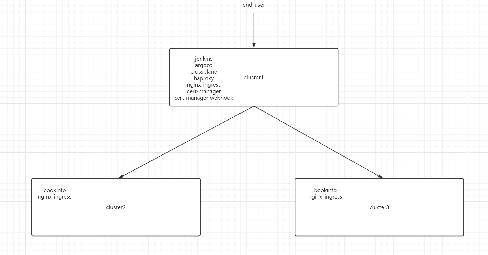

Todo

    使用 Terraform 开通一台腾讯云 CVM, 安装 K3s(集群 1), 并在集群 1 内安装 Jenkins、Argo CD
    书写 Terraform lac 代码: 开通两台腾讯云 CVM, 分别安装 K3s(集群 2、集群 3), 并实现以下要求:
    使用集群 1 作为 Terraform Kubernetes backend 后端存储
    将 laC 源码存储在 GitHub 代码仓库中
    在集群 1 的 Jenkins 中配置流水线, 实现在 lac 代码变更时自动触发变更 (Jenkinsfile)
    在集群 1 的 Argo CD 实例中添加集群 2、3
    使用一个 ApplicationSet +List Generators 在集群 2、集群 3 内的 default 命名空间下同时部署示例应用 Bookinfo(Helm Chart 源码见: iac/lastwork/bookinfo)
    示例应用部署完成后，实现以下架构： assets/img.png
    备注
    这是一个理想的多云灾备部署场景, 集群 1、2、3 可能分别部署在不同云厂商。集群 1 的 Proxy 作为流量入口对外提供服务，对部署在集群 2 和集群 3 的无状态示例应用 Bookinfo 做负载均衡。

Steps

    1 terraform init  &&  terraform apply -auto-approve
    2 cluster1 中会安装 jenkins\argocd\haproxy\cert-manager\ingress\crossplane
    3 jenkins 自动运行流水线，部署 cluster2  cluster3
    4 argocd login argo.starmooc.net
    5 argocd cluster add default  --kubeconfig=config2.yaml --name=k8s-2 --label use=prod
    6 更改 haproxy 的 configmap
    7 访问 bookinfo.starmooc.net

Argocd

#安装 argocd cli
curl -sSL -o argocd-linux-amd64 https://github.com/argoproj/argo-cd/releases/latest/download/argocd-linux-amd64
sudo install -m 555 argocd-linux-amd64 /usr/local/bin/argocd
rm argocd-linux-amd64

#安装 argo-rollouts
kubectl create ns argo-rollouts
kubectl apply -n argo-rollouts -f  https://ghproxy.com/https://github.com/argoproj/argo-rollouts/releases/latest/download/install.yaml
#安装 argo-rollouts dashboard
wget https://github.com/argoproj/argo-rollouts/releases/download/v1.6.4/kubectl-argo-rollouts-linux-amd64
sudo install -m 755 kubectl-argo-rollouts-linux-amd64 /usr/local/bin/kubectl-argo-rollouts
jenkins:
使用 JCasC 配置多分支流水线任务
使用 kubernetes-secret 插件自动配置 credentials
    #acquire default password
    kubectl -n argocd get secret argocd-initial-admin-secret -o jsonpath="{.data.password}" | base64 -d
    #
    argocd admin initial-password -n argocd
    
    #add cluster 
    argocd cluster add default  --kubeconfig=config2.yaml --name=k8s-2 --label use=prod
    
    argocd 配置域名后不能访问
    在参数里添加 --insecure
    或者在 ingress 里自动生成证书，注意要添加 annotations
    
    #install argocd
    curl -sSL -o argocd-linux-amd64 https://github.com/argoproj/argo-cd/releases/latest/download/argocd-linux-amd64
    sudo install -m 555 argocd-linux-amd64 /usr/local/bin/argocd
    rm argocd-linux-amd64

Jenkins

    使用 JCasC 配置多分支流水线任务
    使用 kubernetes-secret 插件自动配置 credentials

cert-manager 

    部署不成功,需要手动部署crd资源,或者修改value的值，官网有说明

k8s

    source <(kubectl completion bash)
    kubectl get workspace k3s-2 -o yaml | yq .status.atProvider.outputs.public_ip

